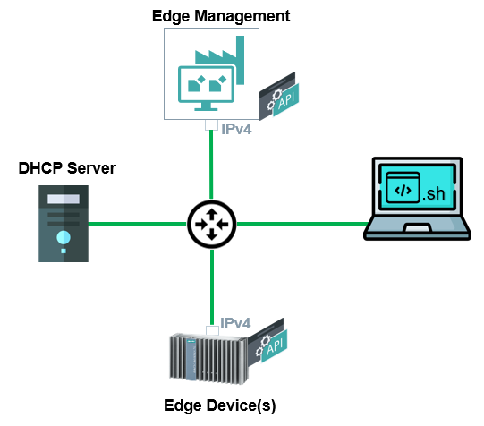

# Industrial Edge Control

Industrial Edge Control (IECTL) is a command line tool that enables you to interact with APIs of Industrial Edge components using just commands. This document describes how to use IECTL to automate workflow from provisioning IEM, onboarding Edeg Devices to automaticaly deploying Edge applications.

- [Industrial Edge Control](#industrial-edge-control)
  - [Description](#description)
    - [Overview](#overview)
    - [General task](#general-task)
  - [Requirements](#requirements)
    - [Prerequisites](#prerequisites)
    - [Used Components](#used-components)
  - [Installation](#installation)
  - [Documentation](#documentation)
  - [Contribution](#contribution)
  - [Licence & Legal Information](#licence--legal-information)

## Description

### Overview

This application example shows how to install and use IECTL in a complete workflow to automatically setup Edge components in 3 steps:

  1. Activate IEM
  2. Onboard Edge device
  3. Deploy Edge applications

### General task
The main goal of this example is to show how to setup the Industrial Edge platform in an automated workflow using IECTL. The idea is  to provide with several shell scripts which can be executed from a device which has connection to the Industrial Edge componments you want to interact with. This application example follows the network structure dispayed in the picture below. The workflow starts with activating IEM in IE HUB, continues with automatic onboarding of one Edge Device and finally custom application is uploaded and deployed to the onboarded device. The provided shell scripts can be used and scaled for multiple IEMs, IEDs or applications.

## Requirements

### Prerequisites

- All Components are connected to a network with DHCP server available
- All componets have a IP adress
- IEM has connection to IE HUB
- Linux Device with Docker and docker compose installed

### Used Components

- Industrial Edge HUB
- Industrial Edge Managment App v1.4.11
- Industrial Edge Managment OS v1.4.0-42-amd64
- Industrial Edge Device v1.3.0-57
- Ubuntu 20.04

## Installation

The installation steps can be found [here](docs/installation.md)

## Documentation

- You can find further documentation and help in the following links
  - [Industrial Edge Hub](https://iehub.eu1.edge.siemens.cloud/#/documentation)
  - [Industrial Edge Forum](https://www.siemens.com/industrial-edge-forum)
  - [Industrial Edge landing page](https://new.siemens.com/global/en/products/automation/topic-areas/industrial-edge/simatic-edge.html)
  
## Contribution

Thanks for your interest in contributing. Anybody is free to report bugs, unclear documenation, and other problems regarding this repository in the Issues section or, even better, is free to propose any changes to this repository using Merge Requests.

## Licence & Legal Information

Please read the [Legal information](LICENSE.txt)