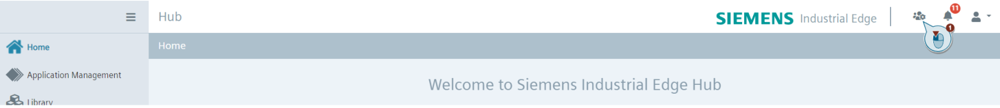

# How to grant API access in Industrial Edge HUB 

1. Go to the Industrial Edge HUB website and login to your organization.

2. Click on the "Organization Settings" button in the right top corner.
   

3. Click on "Grant API Access" button. 

4. Fill in the email address you would like to have access for and click "Save". 

5. Copy the API key from the "Password" section.
   
