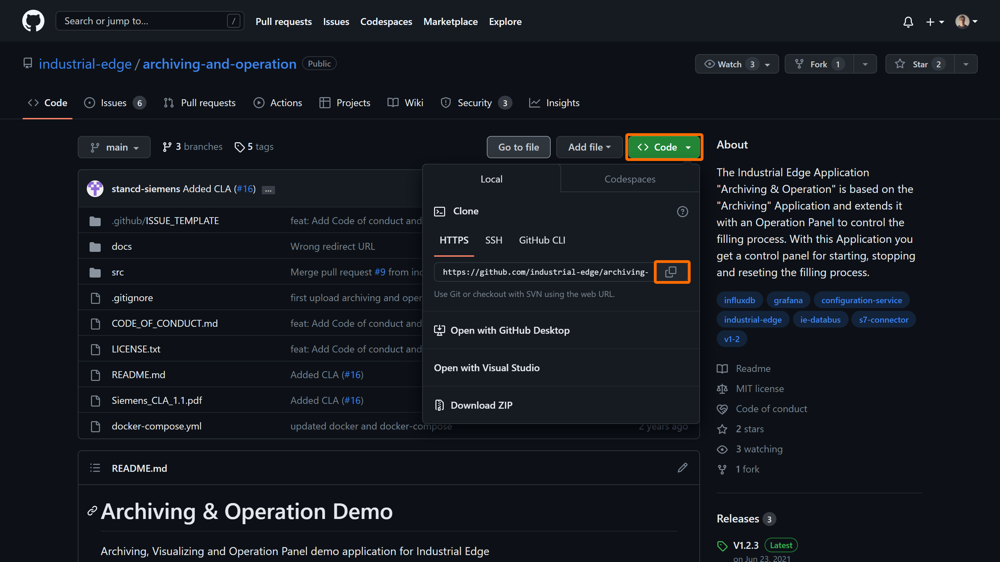
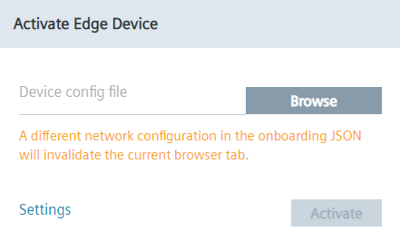
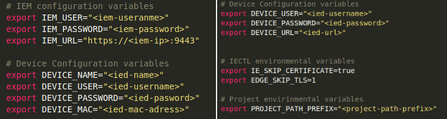
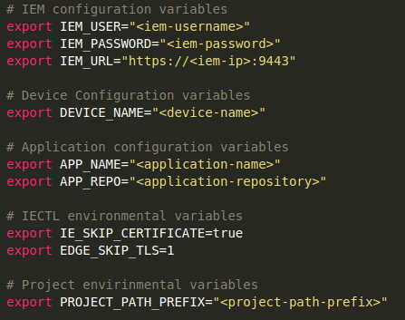

# Provisioning of Industrial Edge components using IECTL


- [Provisioning of Industrial Edge components using IECTL](#provisioning-of-industrial-edge-components-using-iectl)
  - [Prerequisites](#prerequisites)
    - [Install Industrial Edge Control](#install-industrial-edge-control)
    - [Download Repository](#download-repository)
    - [Prepare the environment](#prepare-the-environment)
  - [Activate IEM](#activate-iem)
  - [Onboard Edge device(s)](#onboard-edge-devices)
  - [Deploy custom application](#deploy-custom-application)
    - [Build docker image](#build-docker-image)
    - [Deploy application](#deploy-application)


## Prerequisites

> **Note** Linux machine is used as development environment to run shell scripts with IECTL commands

### Install Industrial Edge Control

1. Go to the IE-HUB and navigate to the "Download Software" section.
2. Click on "Developer Tools" and download Industrial Edge Control executable file for Linux.
3. Extract the file and copy to your Linux device.
4. Open terminal in the directory with the `iectl` executable file and run this command to make IECTL tool executable 

    ```bash
    sudo install ./iectl /usr/bin/
    ```

### Download Repository

Download or clone the repository source code to your workstation.  



* Trough terminal:
```bash
git clone https://github.com/industrial-edge/iectl-workflow.git
```

* Trough VSCode:  
<kbd>CTRL</kbd>+<kbd>&uarr; SHIFT</kbd>+<kbd>P</kbd> or <kbd>F1</kbd> to open VSCode's command pallette and type `git clone`:


### Prepare the environment
 
1. Go to the [src](../src) folder and prepare a file structure like displayed below. Folders `workspace` and `onboarding-file` are missing, please create these empty folders in your development environment. 

    ```txt
    src/
    │   activate-iem.sh
    │   create-ied.sh
    │   activate-ied.sh          
    │   standalone-app.sh
    │
    └───workspace/
    │
    └───onboarding-file/
    │
    └───app/
    │   │   docker-compose.prod.yml
    │   │   docker-compose.yml
    │   └───web/
    │       │   Dockerfile
    │       └───html/
    │
    └───appicon/
    │   │   icon.png
    │
    └───script/
    │   │   getAppId.py
    │   │   getAppVersion.py
    │   │   getDeviceId.py
    ```

## Activate IEM

> **Note** To finish this task, you need to have IE HUB API access granted. This means you need to have API key from IE HUB. Found more information how to grant API access [here](grant-api-acess.md). IP based IEM is used in this example. Steps for activating DNS based setup may differ.

1. Setup the virtual machine with IEM and connect to your network. Make sure the IEM has access to internet. By end of this step the IEM should be accessible from the Linux device to the point, where the activation file is needed.
  
  

2. Go to your Linux environment and open the script for activating IEM. This script can be found [here](../src/activate-iem.sh).

3. Adjust the configuration parameters based on your setup.

  

4. Open up terminal and run this command to start the activation script.

  ```bash
  sh activate-iem.sh
  ```

5. After this step, the IEM instance is created in IE HUB and the activation as well as cluster creation is started automatically. Wait until the cluster creation process is completed. As soon as the IEM is reachable using port 9443 you can continue with the next steps.

## Onboard Edge device(s)

1. Setup your Edge device(s) in such way, that it is connected to your network and has access to IEM. The IED(s) should be accessible from the linux device to the point, where the configuration file is needed.

  

2. Open the [create-ied.sh](../src/create-ied.sh) and [activate-ied.sh](../src/activate-ied.sh) scripts and adjust the configuration and environmental variables in the beginning of the script.

  

3. Run the following commands to create IED instance in IEM and then onboard the device.
  
  ```bash
  sh create-ied.sh
  sh activate-ied.sh
  ```

## Deploy custom application

### Build docker image

- Navigate into `src/app/web` and find the file named `Dockerfile.example`. The `Dockerfile.example` is an example Dockerfile that can be used to build the docker image(s) of the service(s) that runs in this application example. If you choose to use these, rename them to `Dockerfile` before proceeding
- Open a console in the `src/app` folder (where the `docker-compose` file is)
- Use the `docker compose build` (replaces the older `docker-compose build`) command to build the docker image of the service which is specified in the docker-compose.yml file.
- These Docker images can now be used to build your app with the Industrial Edge App Publisher
- `docker images` can be used to check for the images

### Deploy application

1. Open [standalone-app.sh](../src/standalone-app.sh) script and adjust the configuration and environmental variables in the beginning of the script. 

  

3. In order to create a standalone application, upload to IEM and deploy to the newly onboarded Edge device, run the following command to execute the script:

  ```bash
  sh standalone-app.sh
  ```

4. By the end of this step, the application should get deployed to the edge device.