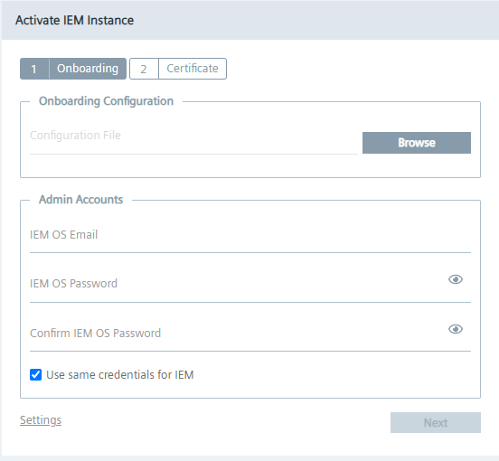
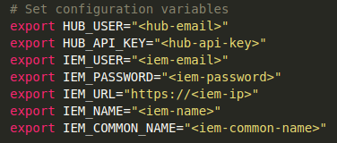

# Provisioning of Industrial Edge components using IECTL


- [Provisioning of Industrial Edge components using IECTL](#provisioning-of-industrial-edge-components-using-iectl)
  - [Prerequisites](#prerequisites)
    - [Install Industrial Edge Control](#install-industrial-edge-control)
  - [Activate IEM](#activate-iem)
  - [Onboard Edge device](#onboard-edge-device)
  - [Deploy custom application](#deploy-custom-application)


## Prerequisites

> **Note** Linux device is used to run shell scripts with IECTL commands

### Install Industrial Edge Control

1. Go to the IE-HUB and navigate to the "Download Software" section.
2. Click on "Developer Tools" and download Indsutrial Edge Control executable file for Linux.
3. Extract the file and copy to your Linux device.
4. Open terminal in the directory with the `iectl` executable file and run this command to make IECTL tool executable 

    ```bash
    sudo install ./iectl /usr/bin/
    ```

## Activate IEM

> **Note** To finish this task, you need to have IE HUB API access granted. This means you need to have API key from IE HUB.

1. Setup the virtual machine with IEM and connect to your network. Make sure the IEM has access to internet. By end of this step the IEM should be accessible from the Linux device to the point, where the activation file is needed. 
  
  

2. Go to your Linux environment and open the script for activating IEM. This script can be found [here](./../src/activate_IEM/activate-iem.sh)

3. Adjust the configuration parameters based on your setup.

  

4. Open up terminal and run this command to start the activation script.

  ```bash
  sh activate-iem.sh
  ```

5. After this step, the IEM instance is created in IE HUB and the activation as well as clustyer creation is started automatically. Wait untill the cluster creation process is completed.

## Onboard Edge device

## Deploy custom application
