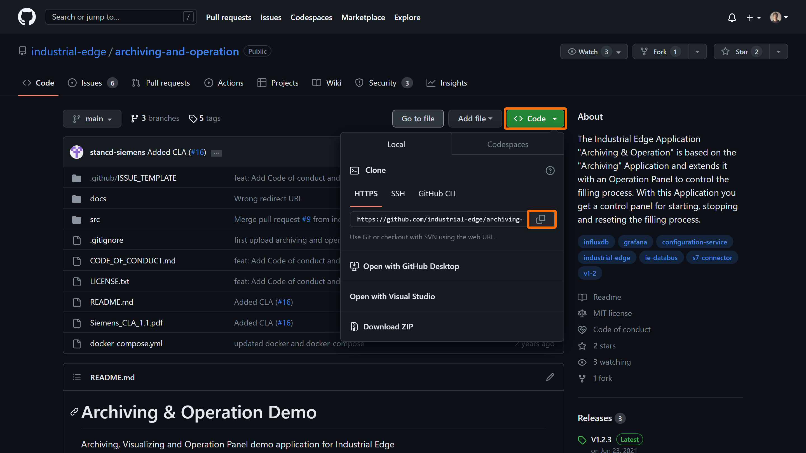
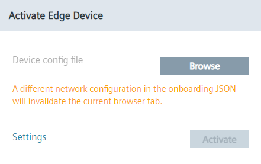
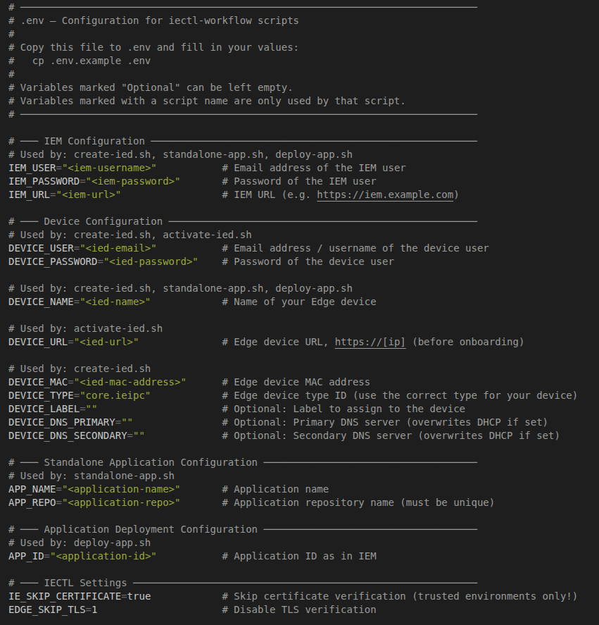

# Provisioning of Industrial Edge components using IECTL

- [Provisioning of Industrial Edge components using IECTL](#provisioning-of-industrial-edge-components-using-iectl)
  - [Prerequisites](#prerequisites)
    - [Install Industrial Edge Control](#install-industrial-edge-control)
    - [Download Repository](#download-repository)
    - [Prepare the environment](#prepare-the-environment)
  - [Onboard Edge device(s)](#onboard-edge-devices)
  - [Deploy custom application](#deploy-custom-application)
    - [Build docker image](#build-docker-image)
    - [Deploy application](#deploy-application)

## Prerequisites

> **Note** Linux machine is used as development environment to run shell scripts with IECTL commands

### Install Industrial Edge Control

1. Go to the IE-HUB and navigate to the "Download Software" section.
2. Click on "Developer Tools" and download Industrial Edge Control executable file for Linux.
3. Extract the file and copy to your Linux device.
4. Open terminal in the directory with the `iectl` executable file and run this command to make IECTL tool executable

    ```bash
    sudo install ./iectl /usr/bin/
    ```

### Download Repository

Download or clone the repository source code to your workstation.  


- Trough terminal:

```bash
git clone https://github.com/industrial-edge/iectl-workflow.git
```

- Trough VSCode:  
<kbd>CTRL</kbd>+<kbd>&uarr; SHIFT</kbd>+<kbd>P</kbd> or <kbd>F1</kbd> to open VSCode's command pallette and type `git clone`:


### Prepare the environment

1. Go to the [src](../src) folder and prepare a file structure like displayed below. Folders `workspace` and `onboarding-file` are missing, please create these empty folders in your development environment.

2. Copy `.env.example` to `.env` and fill in your credentials and settings:

    ```bash
    cp .env.example .env
    ```

    ```txt
    src/
    │   create-ied.sh
    │   activate-ied.sh          
    │   standalone-app.sh
    │   .env.example
    │   .env
    │
    └───workspace/
    │
    └───onboarding-file/
    │
    └───app/
    │   │   docker-compose.prod.yml
    │   │   docker-compose.yml
    │   └───web/
    │       │   Dockerfile
    │       └───html/
    │
    └───appicon/
    │   │   icon.png
    │
    └───script/
    │   │   getAppId.py
    │   │   getAppVersion.py
    │   │   getDeviceId.py
    ```

## Onboard Edge device(s)

1. Setup your Edge device(s) in such way, that it is connected to your network and has access to IEM. The IED(s) should be accessible from the linux device to the point, where the configuration file is needed.

  

1. Check the settings in `.env` and adapt to it to match your IEM and device credentials:

    

2. Run the following commands to create IED instance in IEM and then onboard the device.
  
  ```bash
  sh create-ied.sh
  sh activate-ied.sh
  ```

## Deploy application

1. Ensure the `.env` file is configured with the application ID and IEM settings (see [Prepare the environment](#prepare-the-environment)).

  

1. In order to deploy a Application on an Edge device, run the following command to execute the script:

  ```bash
  sh deploy-app.sh
  ```

## Deploy custom application

### Build docker image

- Navigate into `src/app/web` and find the file named `Dockerfile.example`. The `Dockerfile.example` is an example Dockerfile that can be used to build the docker image(s) of the service(s) that runs in this application example. If you choose to use these, rename them to `Dockerfile` before proceeding
- Open a console in the `src/app` folder (where the `docker-compose` file is)
- Use the `docker compose build` (replaces the older `docker-compose build`) command to build the docker image of the service which is specified in the docker-compose.yml file.
- These Docker images can now be used to build your app with the Industrial Edge App Publisher
- `docker images` can be used to check for the images

### Deploy application

1. Ensure the `.env` file is configured with your application and IEM settings (see [Prepare the environment](#prepare-the-environment)).

  

1. In order to create a standalone application, upload to IEM and deploy to the newly onboarded Edge device, run the following command to execute the script:

  ```bash
  sh standalone-app.sh
  ```

1. By the end of this step, the application should get deployed to the edge device.
